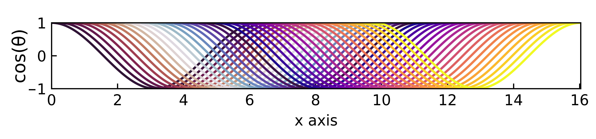

# cleanplot
A clean Python template for plotting custom figures with scientific publishing strandards, using matplotlib/seaborn. Fixes aspect ratio and specific-dimension issues of matplotlib.

Example fig:

